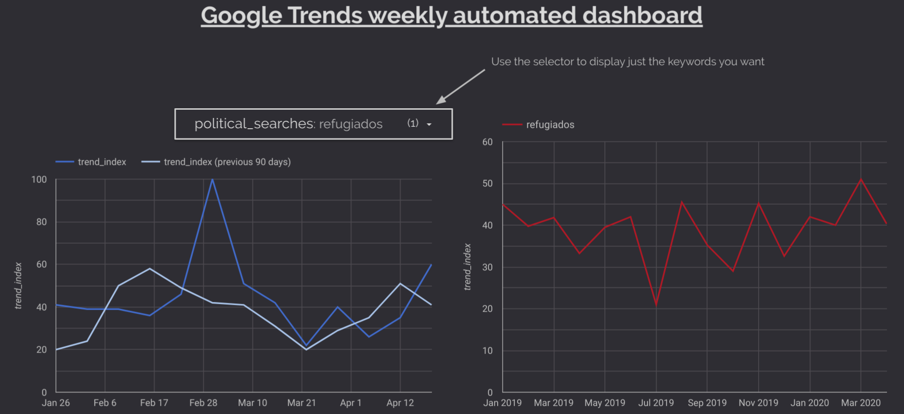

# Socioeconomic Pytrends project.

This is a personal project to learn how to work with the different tools available in Google Cloud for an automated ETL process: From raw data acquisition to the final dashboard. Thanks to it, I've been fighting by my own with credentials, permissions, storage locations, processing locations, 3rd party authentications, pipelines, trigger schedulers with different time format... It's fun.

1. Introduction
2. How to use
3. Results
4. Analyzing results
5. Conclusion
6. Further improvements
7. Documentation

- Sometimes the dashboard seems not up to date, it is because I assign a quota to my leisure projects and some functions stop when it is reached (I'm not Amancio Ortega to spend infinite money in the Cloud).

- ### https://datastudio.google.com/s/iV7dE0FHYSM 

------------------------------

# 1. Introduction.

Let's show a social point of view of the pandemic's impact in Spain, through an automated ETL involving the following tools in Google Cloud:

- Billing: create a maximum budget to avoid unexpected fees (10€,20€,300€... What suits your project).
- Cloud Function number: Python script sending data to Cloud Storage.
        - Requesting data from Google Trends API.
        - Requesting data from other API (in progress).
- Pub/Sub topic: Triggers (activates) the Cloud Function.
- Cloud Scheduler: Schedule a Pub/Sub topic.
- Cloud Storage: Data Lake. Gets fed periodically with the python script.
- Dataprep: Load periodically from Cloud Storage to BigQuery.
- BigQuery: Data Warehouse. 
        - Creates different tables with the output of dataprep. 
        - Performs a weekly query modifying tables.
- Data Studio: Dashboard of results weekly updated, linked to the BigQuery tables.

The Python ETL pipeline is based on this article:

https://towardsdatascience.com/creation-of-an-etl-in-google-cloud-platform-for-automated-reporting-8a0309ee8a78

The Gdelt Queries are based on the shared knowledge with the Data Team of Labelium España:

https://medium.com/@a.vargas.pina/biqquery-and-the-gdelt-project-beyond-dreams-of-marketing-analysts-62e586cc0343

-------------------------

# ***Golden rules for Cloud Services***:

- **1. Your wallet is your sacred temple:** If you won't read all Google documentation carefully, at least go to billing and create a budget with alerts for your project, in case you do something wrong, receiving custom alerts before you spend a lot without noticing. Don't end up living under a bridge. 

- **2. Your sacred temple has no protection by default:** Budget alerts won't cap payment when the limit is reached. They just alert you so you have time to turn everything down in case of panic. It can be configured to cap tho. 
- **3. Worship Location:** While working on the different stages of your project, pay attention to put all your stuff in the very same region. Beware of headaches if don't. 
- **4. Don't panic:** That's all.
---------------------

### Used tools to analyse the internet in Spain:

***Google Trends***:

Google Trends is a Google tool that analyses the popularity of top search queries in Google Search across various regions and languages. Basically, what people are looking for in Google.

Google trends searches the maximum on the specified period, makes that maximum the 100% of Trend Index and everything else is averaged by that top. If you request information weekly, you will have a point with 100% of Trend Index each week, regardless how popular it is.

- If you request a list of elements, all elements will be averaged by the top one.

- If you request each of your keywords separately, each keyword will be averaged on time by its own top.

***Gdelt Project***:

The Gdelt Project is a database with all the news of the world, updated every 15 minutes. It also classifies the incoming data, so you can search topics, themes, people, related people to them... It is impressive, and available via BigQuery.

---------------------------
---------------------------
-----------------------------

***Stuff for myself from the future. Running schedules:***

**Python script.**

- Cloud Scheduler: 00 20 * * 0 Europe(Paris). It means it will run every sunday at 20:00. Run the job in cloud scheduler doesn't mean the cloud function that is activated for that runs. It means it can do it right (as far as I am concerned at 09.05.20).

- Cloud Function: Testing it will modify the outcome in Cloud Storage.

- Dataprep: Weekly at sundays 8:30 pm, Europe/Paris (it has a different time format than Cloud Scheduler). Running jobs will modify what is in BigQuery.

- BigQuery: This schedule will run Every Sun at 21:00 Europe/Paris, starting Sun May 10 2020

**Gdelt BigQuery.**

(Still in development)

------------------
------------------
-----------------

# 2. How to:

### Billing.

In Cloud environment, select your project, go to billing, and take a glance. Just select a weekly/monthly budget to your project, remember that it is linked to your bank account and a wrong action can cost a lot of money if you don't pay attention.

### Create a new project and get your credentials here:

https://console.cloud.google.com/projectselector2/iam-admin/serviceaccounts?_ga=2.187077160.1256540572.1587286598-806021438.1579453370&pli=1&supportedpurview=project

- Service Account: Give it a nice name
- Grant this service account access to the project: Just the required roles for Cloud Storage and Cloud Function.

### Create a bucket in Cloud Storage

https://console.cloud.google.com/storage/create-bucket?
        
- Configure it: Due to our requirements we will use region location, but be careful, it can give you a hard headache, mainly if working with BigQuery or data from other regions that are not your selected one. Always locate all buckets where all data sources you are using for the same project. 

### Pytrends (keywords without accents or capital letters). The chosen keywords for this project:

    - Videocalls: Zoom, Teams, Skype, Hangouts.
    - Messaging apps: WhatsApp, Telegram, Viber, Tiktok.
    - Politics: refugiados, inmigración, nacionalismo, corrupción, juicio, guerra comercial.
    - Health: coronavirus, pandemia, infeccion, médico.
    - Services: Amazon, Netflix, HBO, Rakuten, Steam, Cabify, taxi, Glovo, Just Eat, Deliveroo, Uber Eats.
    - Habits: Comida a domicilio, hacer deporte, yoga, meditación.
    - Improvement: Teletrabajo, videollamada, videoconferencia, cursos online.

- We have our reasons to not include keyword category within the code.

- We are intentionally requesting all information from the same start date while end date varies with time, we believe this is the most accurate way of requesting from Google Trends due to how Google process the asked data.

- Why this folder has this structure can be found here:

        https://github.com/albertovpd/pytrends_cloud_function_example

- Python script is available in this folder.

### Deploy the scripts on Google Cloud Function:

1. Create a function here
        
                https://console.cloud.google.com/functions/add?
         
2. Trigger: Pub/sub
3. Give a name to your pub/sub topic
4. Runtime: Python 3.7
5. Stage bucket: The bucket you created in GCS
6. Advanced options:
    - Region: Select the same region than the created bucket in GCS (this is very important)
    - Environment variables: In the code, for private stuff like paths or keywords, instead of writing them, do something like <os.getenv("PROJECT_NAME")> (check the code). Then in this section, write PROJECT_NAME and its real value, both without the str symbol (" "). It looks like it does not work with os.dotenv.
 

### Go to Cloud Scheduler to schedule your topic

                https://console.cloud.google.com/cloudscheduler/appengine

1. Select the same region than all before
2. Follow instructions and check your cronjob works :)

### Dataprep:

Dataprep will load and transform files from Cloud Storage to BigQuery tables in a scheduled process.

- Select your project
- **Very important:** Go to Settings/profile and locate your Dataprep folder in the same region than the rest of your other Google tools. Personally, I created a new bucket in Cloud Storage, with my Location and subfolders tmp and run_job. 
- Select the Cloud Storage bucket (dataset or datasets).
- Create a recipe.
- Select an output for the recipe, Select the BigQuery table you will populate for manual and schedule job.
- Select wether you want to append or modify the existing tables in BigQuery.
- In the workflow, use the calendar icon to schedule it (beware of time formats between Cloud Function, Dataprep, BigQuery... Use always the same location (if you can)).

### Bigquery:

1. Go there.
2. Create a scheduled query requesting from the tables periodically fed by Dataprep, and save them in other tables.

In this folder you will find the sql query, in case you want to take a glance.

### Data Studio:

Find your tables in BigQuery and make some art.

**Warning:** I learnt by the hard way not to use Custom Query option in DataStudio, because every time someone opens the dashboard, the query will be performed, and it can cost you kind of A LOT. So always, create your dashboards from BigQuery tables.

Hopefully reddit has a great BigQuery community, and it worth taking a glance there. This was the issue if you're curious: https://www.reddit.com/r/bigquery/comments/gdk5mo/some_help_to_understand_how_i_burnt_the_300_and/

**- Gdelt Project.**

This is currently under construction, we need to study how to optimize costs and processing (the query available here process more than 300GB, and costs some money. It is better to invest that money in queries from the same date or in storage? We do not know, yet :) )

Target:
- Filter by country.
- Analyse the sentiment of each filtered news.

An example of what we want is here, to check certain topics in Spain and analyse the related sentiment:

The query is available in this folder: ***bigquery_gdelt_project_sql***

---------------------------

# 3. Results

Results can be found here:

https://datastudio.google.com/s/iV7dE0FHYSM

-------------------------
# 4. Analyzing results

Do you remember when refugees or nationalism were main topic on TV in Spain? The topic will come back for other reasons like an economical crisis across Europe?  How long is going to be the keyword "economical war" the main topic of some politicians?

The circumstances we live right now are temporal or it will be part of our future? 

People will spend more money on non necessary purchases like ordering food from home?

Remote working will last after the crisis?
 
People will loose confidence in WhatsApp privacy? Tiktok will be part of our culture as a result of the lockdown?

At this date, wednesday 22.04.20, it is not easy to give an answer, nevertheless this dashboard would help us to understand the short term past, the present, and maybe the close future.

The result can be found here: 
https://datastudio.google.com/s/lmWzf76qh90

-----------------------

# 5. Conclusion 

Personally, this project has help me to reinforce my skills developing an ETL pipeline in Google Cloud environment.

I am exited to start the improvements, improve the Gdelt part, and use Twitter API to generate a dashboard portraying the spanish social situation.

---------------------

# 6. Further improvements.

- All themes available in Gdelt:

                WITH nested AS (
                SELECT SPLIT(RTRIM(Themes,';'),';') themes FROM `gdelt-bq.gdeltv2.gkg_partitioned` WHERE _PARTITIONTIME >= "2019-09-04 00:00:00" AND _PARTITIONTIME < "2019-09-05 00:00:00" and length(Themes) > 1
                ) select theme, count(1) cnt from nested, UNNEST(themes) as theme group by theme order by cnt desc

I am sure there are more themes than I used here that worth monitoring across the country.

- Use Python APis to track Stock Markets on time.

----------------------------

# 7. Documentation:

- What is Google Trends (no code)   https://www.karinakumykova.com/2019/03/calculate-search-interest-with-pytrends-api-and-python/

- List of categories: https://github.com/pat310/google-trends-api/wiki/Google-Trends-Categories

- Official documentation: https://pypi.org/project/pytrends/
- Info about how it works: https://www.karinakumykova.com/2019/03/calculate-search-interest-with-pytrends-api-and-python/
- The "real" Google Trends: https://towardsdatascience.com/google-trends-api-for-python-a84bc25db88f
- A great tutorial https://searchengineland.com/learn-how-to-chart-and-track-google-trends-in-data-studio-using-python-329119

--------------------------------

Project by Alberto Vargas.

https://www.linkedin.com/in/alberto-vargas-pina/

Many thanks to:

- Alex Masip, Head of Data at Labelium España https://www.linkedin.com/in/alexmasip/
- César Castañón: https://www.linkedin.com/in/cesar-castanon/

---------------------

